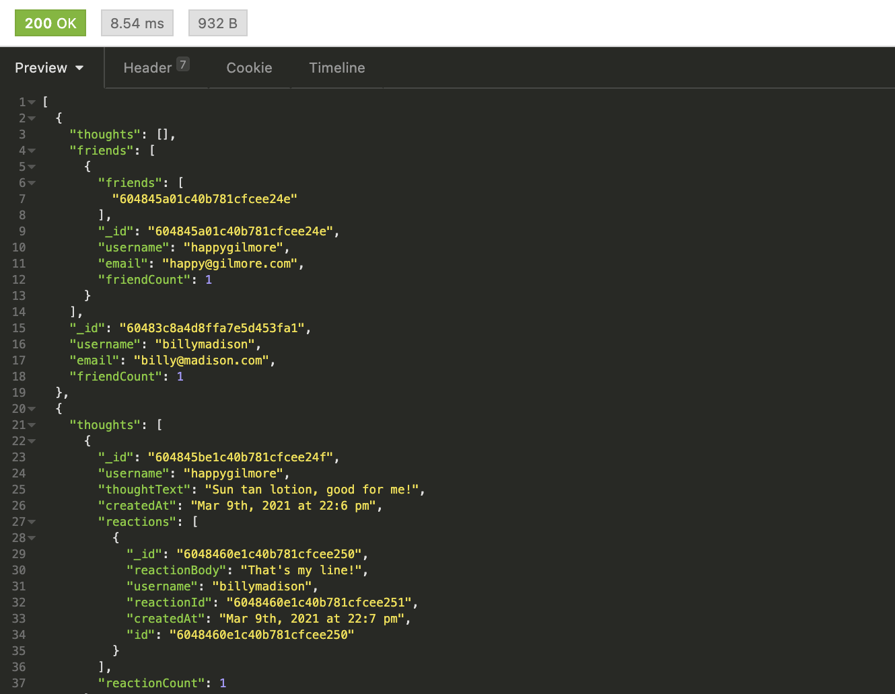

# Social Network API

## Description
This is the backend of a social network API application that uses MongoDB and runs off Mongoose and Express allowing the user to create, edit and remove thoughts, while adding and removing friends who can read their thoughts and react in their own words. Reactions can also be removed. 

- Link: [See how the Social Network API works in this video tutorial](https://drive.google.com/file/d/1ZDTo9tuwJ0un8GYSnxfUBsG6hNqecbLr/view)

- Link: [See the GitHub Repository for this application here](https://github.com/kohringsw/readme-generator.git)

## Table of Contents
- [Description](#description)
- [Installation Instructions](#installation)
- [Contributors](#contributors)
- [Testing] (#testing)
- [License](#license)
- [Questions](#questions)

## Installation Instructions
- Required Installation
  - express
  - mongoose
  - MongoDB

## Contributors
Shelby Kohring

## Testing
All testing can be done in Insomnia Core using the following routes:
- Create and Get All Users: localhost:3001/api/users
- Get, Update and Delete Users By ID: localhost:3001/api/users/:userid
- Add and Remove Friends: localhost:3001/api/users/:userId/friends/:friendId
- Create and Get All Thoughts: localhost:3001/api/thoughts
- Get, Update and Delete Thoughts By ID: localhost:3001/api/thoughts/:thoughtId
- Create Reactions to Thoughts: localhost:3001/api/thoughts/:thoughtId/reactions
- Delete Reactions: localhost:3001/api/thoughts/:thoughtId/reactions/:reactionId

## License 
None

## Questions
If you have questions about this application: 
- Find me on [GitHub: kohringsw](https://github.com/kohringsw) or 
- Email me at [kohringsw@gmail.com](mailto:kohringsw@gmail.com)